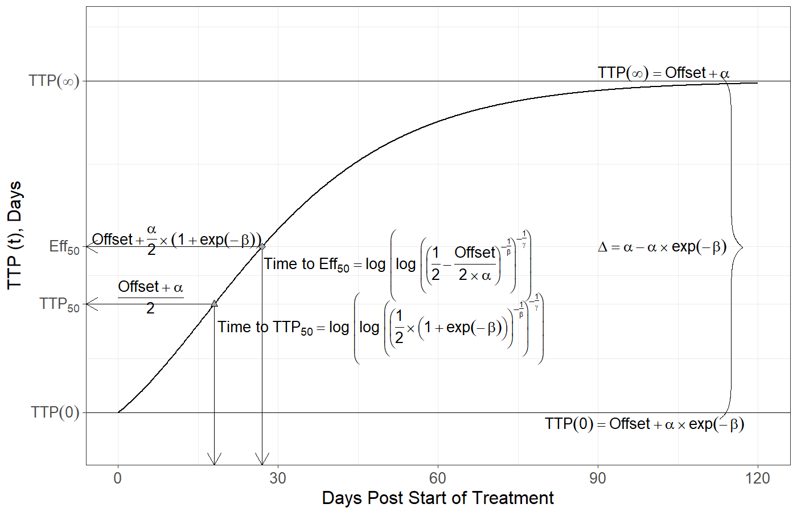
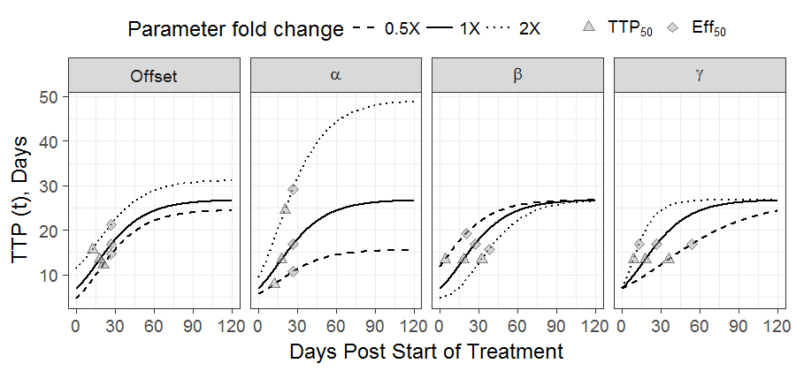

### 1- Gompertz Model Definition, Properties and Equations:
This page allows the user to explore the TTP curve over time using the modeled Gompertz equation.
$${\text{TTP}(t)=Offset +\alpha*\exp\left[-\beta*\exp\left(-\gamma*\text{Time}\right)\right]}$$
Where $Offset$ is the theoretical lower asymptote, $\alpha$ is the upper asymptote, $\beta$ is a shape parameter controlling where the curve starts and $\gamma$ is a shape parameter controlling the steepness of the curve. On this curve we are interested in several quantities of interest illustrated in this plot:

{ width=70% }

The plot also includes two points of interest:   
A gray triangle representing $\text{TTP}_{50}$ and the time to reach it. $\text{TTP}_{50}$ is defined as:
$${\text{Time to TTP}_{50}=\log\left(\log\left(\left(\frac{1}{2}-\frac{Offset}{2*\alpha}\right)^{\frac{-1}{\beta}}\right)^{\frac{-1}{\gamma}}\right)}$$

A gray diamond representing $\text{Eff}_{50}$ and the time to reach it. $\text{Eff}_{50}$ is defined as:
$${\text{Time to Eff}_{50}=\log\left(\log\left(\left(\frac{1}{2}*\left(1+\exp\left(-\beta\right)\right)\right)^{\frac{-1}{\beta}}\right)^{\frac{-1}{\gamma}}\right)}$$
  

Two other values of interest on the curve are the TTP value at the start of treatment Time = 0 and at Time = $\infty$

$${\text{TTP}(0)=Offset +\alpha*\exp\left[-\beta\right]}$$
$${\text{TTP}(\infty)=Offset +\alpha}$$
The $\Delta$ parameter is the distance between $\text{TTP}(0)$ and $\text{TTP}(\infty)$

Finally to help in illustrating the effect of each paramter on the curve, the effects of varying one parameter at a time to half its value 0.5X and double its value 2X as compared to the starting value 1X are shown. Note that the solid black curve is the same across all plots.

{ width=90% }

                         

